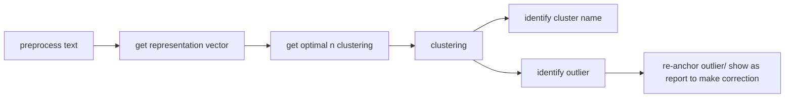

# Introduction
We have data about system behaviour. Our data is described in both Thai and English so It needed to support multilingual data. Our problem, the named-entities in these documents are inconsistent. Identifying pre-defining target classes is impossible. So, we want to do open-end named-entities clustering and ultimately identify consensus of cluster identity and make corrections to the inconsistency term.
	
Named entities introduce several challenges for clustering as some naming sense references from cultures and context. Therefore, we think some kind of Knowledge based or context expansion are needed to further enrich embedding quality to improve clustering accuracy. also fewshot stradegy might necessary to scope how fingrain we need for clustering.
	
I have several proposed methods sorted by implementation feasibility.

## candidate approaches

| Approach | Model(s) | Inspiration | Paper | MVP |
| :--- | :--- | :--- | :--- | :--- |
| listwise clustering using proprietary model | gemini 2.5-pro | listwise ranking in general, prompt engineering | |
| MVP: Dense Vector based Embedding | embedgemma3 | normal text based clustering | |
| Dense Vector based Embedding with SLM for context expansion | gemma3 7B 4bit qt model -> embedgemma3 | question generation, context expansion, named entity often be just a word. So, more description = easier to be identified. | |
| Let SLM reason on how this named entity have roles in this context then extract attention state after finish reasoning to may be have better coherent | gemma3 7B reasoning model | autoregressive nature of decoder based transformer -> more reasoning attention to detail will be updated so the reason might be more closer | |

## metrics
we will test these matrix to decide which method is best
- end-to-end computational time
    - indexing 
    - clustering
    - identifying consensus
- noticable pros
- average number of outlier in each cluster
- number of perfect cluster (all correct)  

For identifying the right number of clusters I will use the traditional minimize silhouette score. and Identify the cluster name by basically normal text generation based on member name, identifying outlier altogether also we might measure cluster density score to see how it is fit together.

# overall flows

# model used
- Embedding gemma3
    - link: https://huggingface.co/google/embeddinggemma-300m
    - term of uses: https://ai.google.dev/gemma/terms
    - property
        - Maximum input context length of 2048 tokens
        - output dim: 768, 512, 256, or 128
## to download nay model
1. ```pip install huggingface-hub```
2. cd to desired directory 
3. ```huggingface-cli download --local-dir ./model_name reponame(e.g google/embeddinggemma-300m)```